IMPORTANT ❗ ❗ ❗ Please remember to destroy all the resources after each work session. You can recreate infrastructure by creating new PR and merging it to master.


                                                                                                                                                                                                                                                                                                                                                                                  
## Phase 1 Exercise Overview

  ```mermaid
  flowchart TD
      A[🔧 Step 0: Fork repository] --> B[🔧 Step 1: Environment variables\nexport TF_VAR_*]
      B --> C[🔧 Step 2: Bootstrap\nterraform init/apply\n→ GCP project + state bucket]
      C --> D[🔧 Step 3: Quota increase\nCPUS_ALL_REGIONS ≥ 24]
      D --> E[🔧 Step 4: CI/CD Bootstrap\nWorkload Identity Federation\n→ keyless auth GH→GCP]
      E --> F[🔧 Step 5: GitHub Secrets\nGCP_WORKLOAD_IDENTITY_*\nINFRACOST_API_KEY]
      F --> G[🔧 Step 6: pre-commit install]
      G --> H[🔧 Step 7: Push + PR + Merge\n→ release workflow\n→ terraform apply]

      H --> I{Infrastructure\nrunning on GCP}

      I --> J[📋 Task 3: Destroy\nGitHub Actions → workflow_dispatch]
      I --> K[📋 Task 4: New branch\nModify tasks-phase1.md\nPR → merge → new release]
      I --> L[📋 Task 5: Analyze Terraform\nterraform plan/graph\nDescribe selected module]
      I --> M[📋 Task 6: YARN UI\ngcloud compute ssh\nIAP tunnel → port 8088]
      I --> N[📋 Task 7: Architecture diagram\nService accounts + buckets]
      I --> O[📋 Task 8: Infracost\nUsage profiles for\nartifact_registry + storage_bucket]
      I --> P[📋 Task 9: Spark job fix\nAirflow UI → DAG → debug\nFix spark-job.py]
      I --> Q[📋 Task 10: BigQuery\nDataset + external table\non ORC files]
      I --> R[📋 Task 11: Spot instances\npreemptible_worker_config\nin Dataproc module]
      I --> S[📋 Task 12: Auto-destroy\nNew GH Actions workflow\nschedule + cleanup tag]

      style A fill:#4a9eff,color:#fff
      style B fill:#4a9eff,color:#fff
      style C fill:#4a9eff,color:#fff
      style D fill:#ff9f43,color:#fff
      style E fill:#4a9eff,color:#fff
      style F fill:#ff9f43,color:#fff
      style G fill:#4a9eff,color:#fff
      style H fill:#4a9eff,color:#fff
      style I fill:#2ed573,color:#fff
      style J fill:#a55eea,color:#fff
      style K fill:#a55eea,color:#fff
      style L fill:#a55eea,color:#fff
      style M fill:#a55eea,color:#fff
      style N fill:#a55eea,color:#fff
      style O fill:#a55eea,color:#fff
      style P fill:#a55eea,color:#fff
      style Q fill:#a55eea,color:#fff
      style R fill:#a55eea,color:#fff
      style S fill:#a55eea,color:#fff
```

  Legend

  - 🔵 Blue — setup steps (one-time configuration)
  - 🟠 Orange — manual steps (GCP Console / GitHub UI)
  - 🟢 Green — infrastructure ready
  - 🟣 Purple — tasks to complete and document in tasks-phase1.md

1. Authors:

   ***Group: 17***

   ***[link to forked repo](https://github.com/soswi/MENG-PW-S1-TBD-WORKSHOP-1)***

2. Follow all steps in README.md.

3. From available Github Actions select and run destroy on master branch.

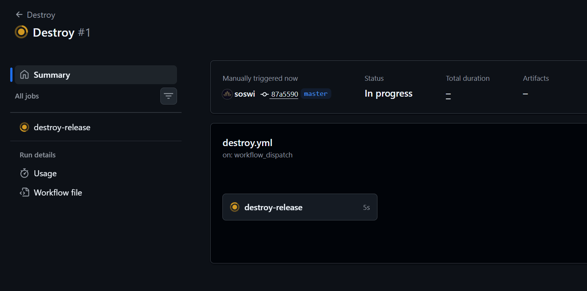
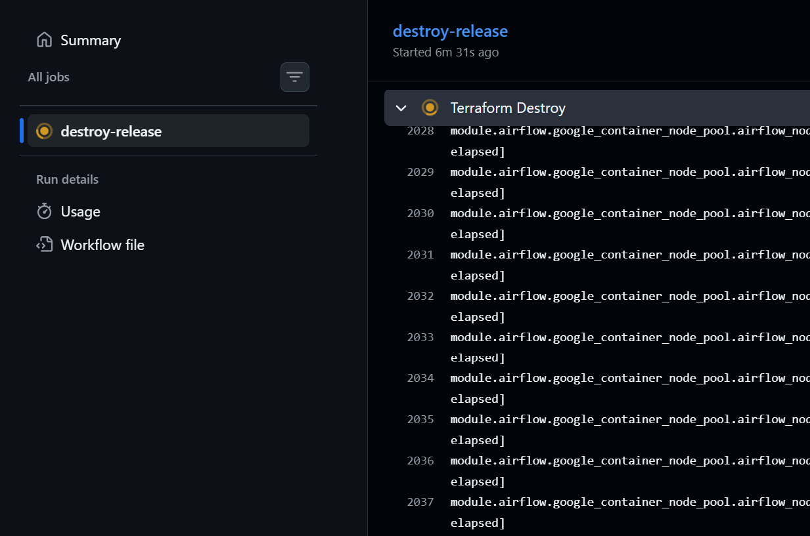
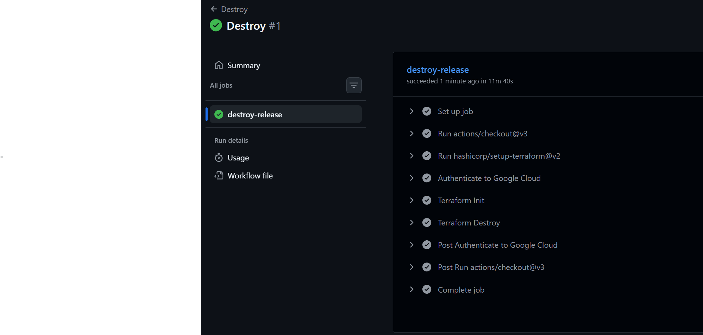

4. Create new git branch and:
    1. Modify tasks-phase1.md file.

    2. Create PR from this branch to **YOUR** master and merge it to make new release.

    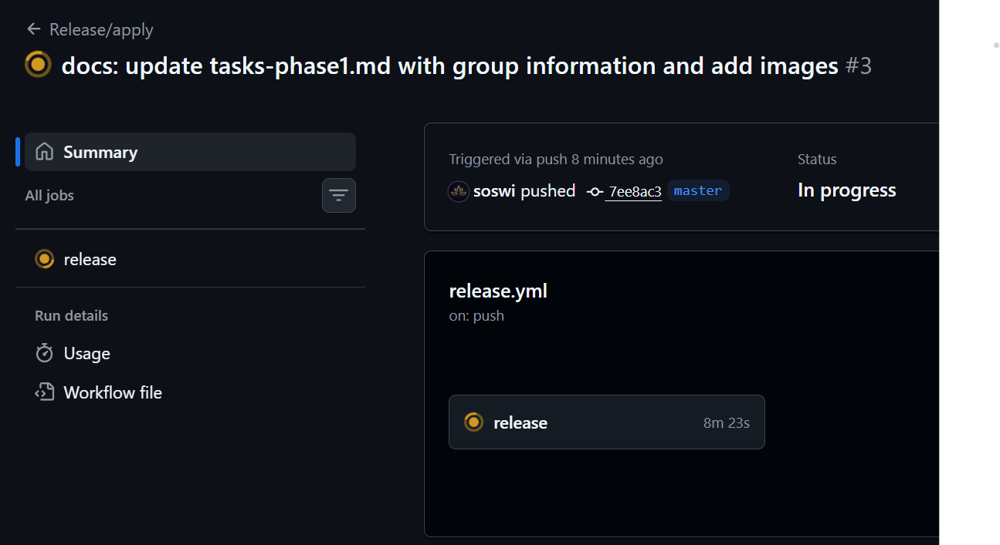
    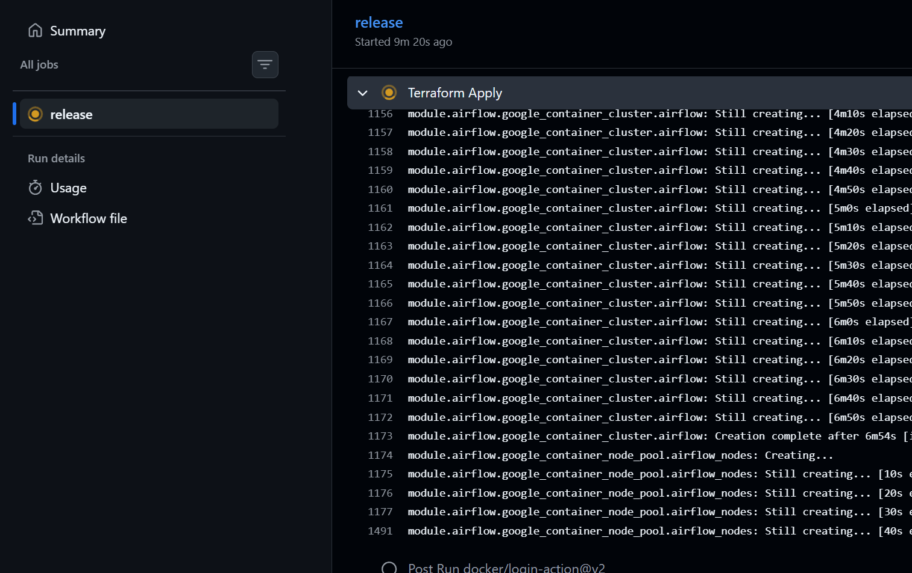
    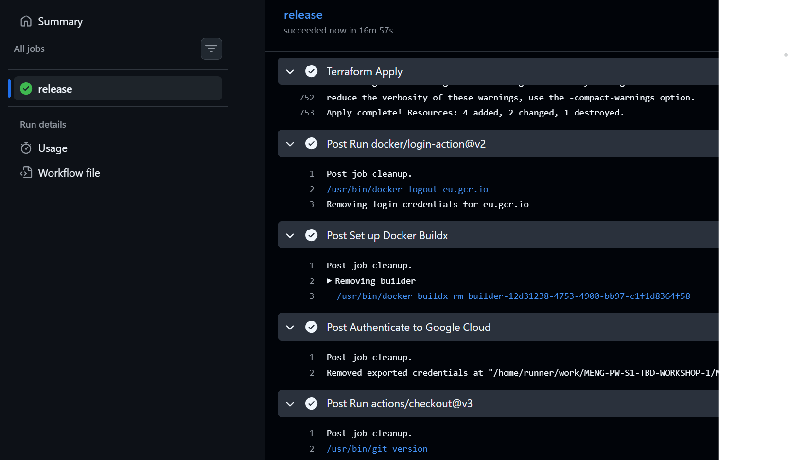


5. Analyze terraform code. Play with terraform plan, terraform graph to investigate different modules.

    ***describe one selected module and put the output of terraform graph for this module here***

6. Reach YARN UI


   `gcloud compute ssh tbd-cluster-m \
  --project tbd-2026l-348561 \
  --zone europe-west1-b \
  --tunnel-through-iap \
  -- -L 0.0.0.0:25568:localhost:8088 -N`

   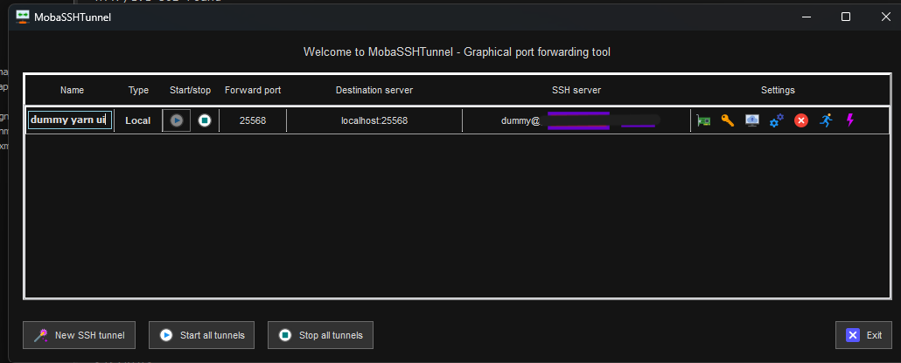
   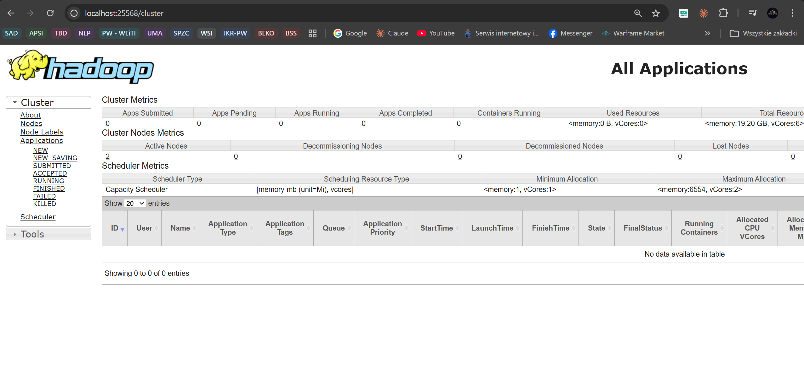

   Hint: the Dataproc cluster has `internal_ip_only = true`, so you need to use an IAP tunnel.
   See: `gcloud compute ssh` with `-- -L <local_port>:localhost:<remote_port>` and `--tunnel-through-iap` flag.
   YARN ResourceManager UI runs on port **8088**.

7. Draw an architecture diagram (e.g. in draw.io) that includes:
    1. Description of the components of service accounts
    2. List of buckets for disposal

    ***place your diagram here***

8. Create a new PR and add costs by entering the expected consumption into Infracost
For all the resources of type: `google_artifact_registry_repository`, `google_storage_bucket`
create a sample usage profiles and add it to the Infracost task in CI/CD pipeline. Usage file [example](https://github.com/infracost/infracost/blob/master/infracost-usage-example.yml)

   ***place the expected consumption you entered here***

   ***place the screenshot from infracost output here***

9. Find and correct the error in spark-job.py

    After `terraform apply` completes, connect to the Airflow cluster:
    ```bash
    gcloud container clusters get-credentials airflow-cluster --zone europe-west1-b --project PROJECT_NAME
    ```
    
    Then check the external IP (AIRFLOW_EXTERNAL_IP) of the webserver service:
    kubectl get svc -n airflow airflow-webserver                                                                                                                                                                 
                                              
                                                                                                                                                                                                               
    ▎ Note: If EXTERNAL-IP shows <pending>, wait a moment and retry — LoadBalancer IP allocation may take 1-2 minutes.  

    DAG files are synced automatically from your GitHub repo via git-sync sidecar.
    Airflow variables and the `google_cloud_default` GCP connection are also configured by Terraform.

    a) In the Airflow UI (http://AIRFLOW_EXTERNAL_IP:8080, login: admin/admin), find the `dataproc_job` DAG, unpause it and trigger it manually.

    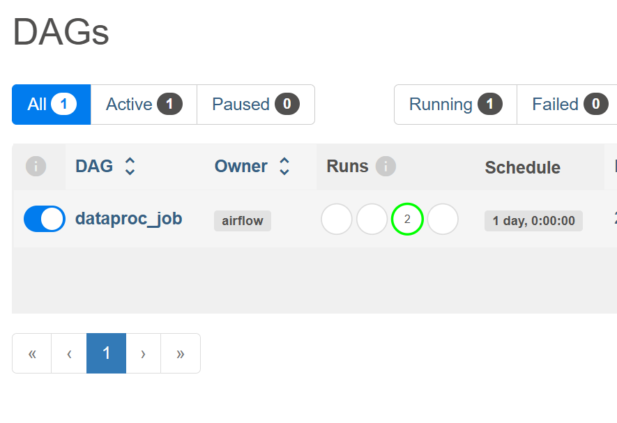

    b) The DAG will fail. Examine the task logs in the Airflow UI to find the root cause.

    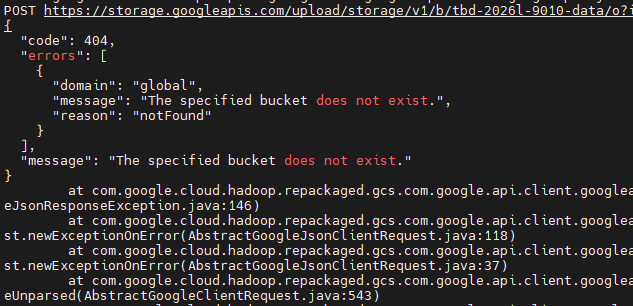

    The error was caused by a hardcoded GCS bucket name belonging to the instructor (tbd-2026l-9010-data) instead of the student's bucket. Line 19 of spark-job.py
    The error was identified by examining the Spark driver logs stored in GCS (driveroutput.000000000), where a GoogleJsonResponseException: 404 Not Found was thrown when attempting to write ORC files to bucket tbd-2026l-9010-data - a bucket that does not exist in the student's GCP project. The fix was to change the bucket name to the correct one

    c) Fix the error in `modules/data-pipeline/resources/spark-job.py` and re-upload the file to GCS:
    ```bash
    dummy@xxx:~/MENG-PW-S1-TBD-WORKSHOP-1$ gsutil cp modules/data-pipeline/resources/spark-job.py gs://tbd-2026l-348561-code/spark-job.py
    Google recommends using Gcloud storage CLI (https://docs.cloud.google.com/storage/docs/discover-object-storage-gcloud) instead of gsutil. Please refer to migration guide (https://docs.cloud.google.com/storage/docs/gsutil-transition-to-gcloud) for assistance.
    Copying file://modules/data-pipeline/resources/spark-job.py [Content-Type=text/x-python]...
    / [1 files][  1.5 KiB/  1.5 KiB]
    Operation completed over 1 objects/1.5 KiB.

    ```
    Then trigger the DAG again from the Airflow UI.

    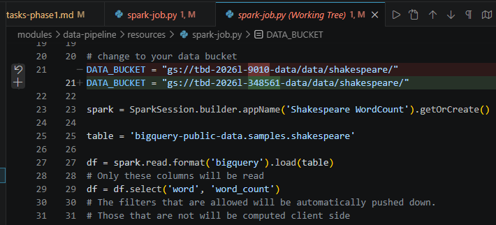

    d) Verify the DAG completes successfully and check that ORC files were written to the data bucket:
    ```bash
    dummy@xxx:~/MENG-PW-S1-TBD-WORKSHOP-1$ gsutil ls gs://tbd-2026l-348561-data/data/shakespeare/
    Google recommends using Gcloud storage CLI (https://docs.cloud.google.com/storage/docs/discover-object-storage-gcloud) instead of gsutil. Please refer to migration guide (https://docs.cloud.google.com/storage/docs/gsutil-transition-to-gcloud) for assistance.
    gs://tbd-2026l-348561-data/data/shakespeare/
    gs://tbd-2026l-348561-data/data/shakespeare/_SUCCESS
    gs://tbd-2026l-348561-data/data/shakespeare/part-00000-ce39b26a-cd1e-4645-8989-c7cae24693c2-c000.snappy.orc
    gs://tbd-2026l-348561-data/data/shakespeare/part-00001-ce39b26a-cd1e-4645-8989-c7cae24693c2-c000.snappy.orc
    gs://tbd-2026l-348561-data/data/shakespeare/part-00002-ce39b26a-cd1e-4645-8989-c7cae24693c2-c000.snappy.orc
    gs://tbd-2026l-348561-data/data/shakespeare/part-00003-ce39b26a-cd1e-4645-8989-c7cae24693c2-c000.snappy.orc
    (...)
    ```

    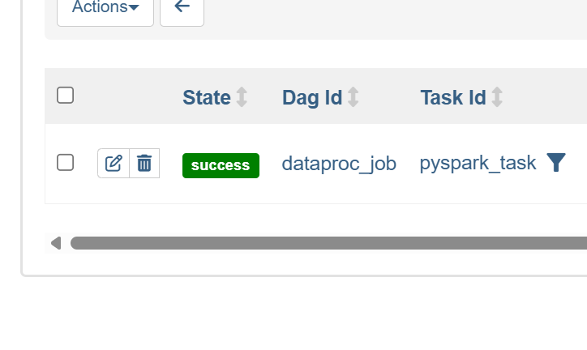

10. Create a BigQuery dataset and an external table using SQL

    Using the ORC data produced by the Spark job in task 9, create a BigQuery dataset and an external table.

    Note: the dataset must be created in the same region as the GCS bucket (`europe-west1`), e.g.:
    ```bash
    bq mk --dataset --location=europe-west1 shakespeare
    ```

    ```bash
    dummy@xxx:~/MENG-PW-S1-TBD-WORKSHOP-1$ bq query --use_legacy_sql=false --project_id=tbd-2026l-348561 \
    'SELECT * FROM `tbd-2026l-348561.shakespeare.shakespeare_orc` ORDER BY sum_word_count DESC LIMIT 10'
    Waiting on bqjob_r144f1dabcfdc342f_0000019e11326823_1 ... (0s) Current status: DONE
    +------+----------------+
    | word | sum_word_count |
    +------+----------------+
    | the  |          25568 |
    | I    |          21028 |
    | and  |          19649 |
    | to   |          17361 |
    | of   |          16438 |
    | a    |          13409 |
    | you  |          12527 |
    | my   |          11291 |
    | in   |          10589 |
    | is   |           8735 |
    +------+----------------+

    ```

    ORC (Optimized Row Columnar) is a self-describing format - it stores the schema (column names, data types, metadata) directly within the file itself. BigQuery can read this embedded schema automatically without requiring the user to define it manually.

11. Add support for preemptible/spot instances in a Dataproc cluster

    `modules/dataproc/main.tf`

    ```json
    preemptible_worker_config {
      num_instances  = 1
      preemptibility = "SPOT"
      disk_config {
        boot_disk_type    = "pd-standard"
        boot_disk_size_gb = 100
      }
    }

    ```

12. Triggered Terraform Destroy on Schedule or After PR Merge. Goal: make sure we never forget to clean up resources and burn money.

Add a new GitHub Actions workflow that:
  1. runs terraform destroy -auto-approve
  2. triggers automatically:

   a) on a fixed schedule (e.g. every day at 20:00 UTC)

   b) when a PR is merged to master containing [CLEANUP] tag in title

Steps:
  1. Create file .github/workflows/auto-destroy.yml
  2. Configure it to authenticate and destroy Terraform resources
  3. Test the trigger (schedule or cleanup-tagged PR)

Hint: use the existing `.github/workflows/destroy.yml` as a starting point.

***paste workflow YAML here***

***paste screenshot/log snippet confirming the auto-destroy ran***

***write one sentence why scheduling cleanup helps in this workshop***
